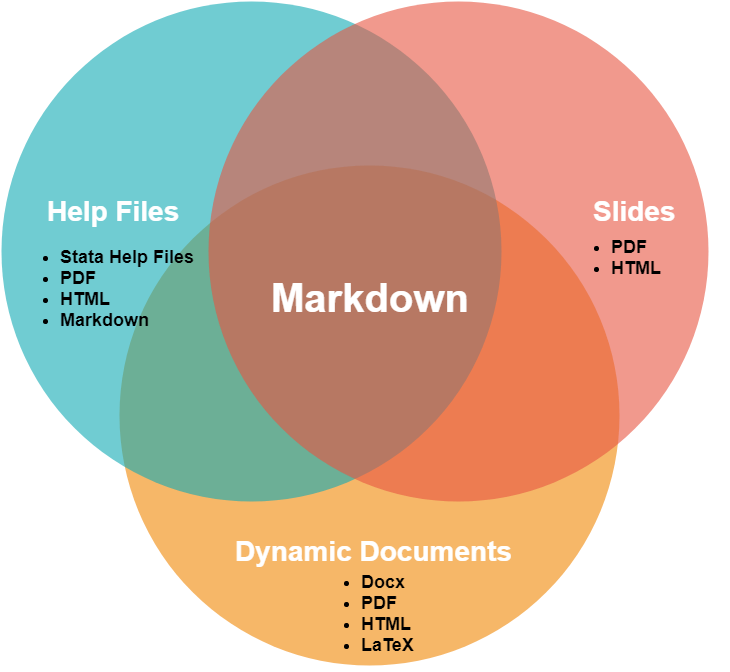
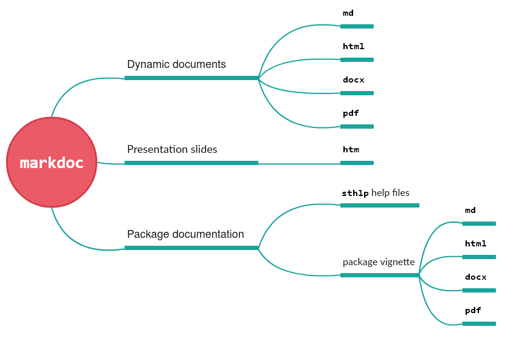

<p align="center">
  
</p>

# MarkDoc : a general-purpose literate programming package for Stata

<a href="http://haghish.com/markdoc"></a>

**MarkDoc** is a general-purpose literate programming package for Stata. **MarkDoc** is very simple and intuitive to use, yet a powerful software for creating dynamic documents interactively in a variety of formats such as *sthlp*, *pdf*, *docx*, *tex*, *html*, *odt*, *epub*, and *markdown*. The software has a considerable focus on making literate programming easy-to-learn and practice for newbies. Therefore, it can be taught to undergraduate students in introductory courses to document code and practice statistical reporting. [Continue to MarkDoc documentation...](https://github.com/haghish/MarkDoc/wiki)

<br>

<a href="http://haghish.com/markdoc"></a>

`markdoc` has a new option - [**`mini`**](https://github.com/haghish/markdoc/wiki/mini) - a light-weight program written completely in Stata that allows Generating *HTML*, *Docx*, *PDF*, *Presenattion slides*, and *Stata Help Files (sthlp)* ***without requiring  [Pandoc](http://pandoc.org/installing.html) and [wkhtmltopdf](http://wkhtmltopdf.org/downloads.html) or any third-party software***. It also offers a new GUI for the engine (type `db mini`). [Read more about the `mini` mode...](https://github.com/haghish/MarkDoc/wiki/mini)

<br>




Once you learn `markdoc`, you can take care of all types of documents you may wish to create for Stata, simply using Markdown. If you are using `markdoc` for data analysis, you can write your documentation with Markdown and generate dynamic documents in **docx**, **pdf**, or **html**, *without requiring any third-party software*. Similarly, if you are a Stata programmer and you wish to write clean and readable documentation that is easy to write and update, you can write your documentation in Markdown and export **`sthlp` Stata Help Files**. You can also generate the package documentation in other formats, for example in Markdown to put them on GitHub, or HTML to host them on your private site. The document convertors are completely written in Stata language!   


## Resources


<a href="https://github.com/haghish/markdoc/wiki">Manual (Wiki) </a>

<a href="https://github.com/haghish/markdoc/raw/master/vignette.pdf">MarkDoc package vignette (PDF)</a>

<a href="http://www.stata-journal.com/article.html?article=pr0064">Journal Article</a>

<a href="https://github.com/haghish/MarkDoc/tree/master/Examples">Examples</a>

<a href="https://github.com/haghish/markdoc/tree/master/Torture_test">Torture tests</a>

<a href="http://www.statalist.org">Need help? Ask your questions on statalist.org</a>

<a href="http://www.haghish.com/contact.php"><b>Need more help</b>? Contact the author to plan a workshop in your department or company</a>


# 1. Installation

__`markdoc`__ requires a few other Stata packages. The [__`github package`__](https://github.com/haghish/github) can be used to install __`markdoc`__ and all of its dependencies automatically. Once [__`github`__](https://github.com/haghish/github) is installed, type the following command to install __`markdoc`__:

```js
github install haghish/markdoc, stable
```

**NEWS**: MarkDoc v. _4.1.0_ introduced the [`mini`](https://github.com/haghish/markdoc/wiki/mini) option to make MarkDoc independent of third-party software that are mentioned below. If you do not wish to install the binaries, [**Read more about the `mini` mode**...](https://github.com/haghish/MarkDoc/wiki/mini)


MarkDoc - if **not** executed in [`mini`](https://github.com/haghish/markdoc/wiki/mini) mode - requires 3 third-party software based on the document format you wish to create. These software are:

- [__Pandoc__](http://pandoc.org/installing.html)
- [__wkhtmltopdf__](http://wkhtmltopdf.org/downloads.html)
- [__pdfLaTeX__](https://www.latex-project.org/get/)

The __pdfLaTeX__ is optional, but required for generating PDF slides and typesetting documents written in LaTeX. The __wkhtmltopdf__ is only required for generating stylish PDF documents (you can create PDF documents in the [`mini`](https://github.com/haghish/markdoc/wiki/mini) mode as well). MarkDoc provides optional automatic installation of __pandoc__ and __wkhtmltopdf__ if the `install` argument is specified. [You can read more about the installation in the manual...](https://github.com/haghish/markdoc/wiki/Installation)


## 1.1 MarkDoc Mini Mode

As noted earlier, a new engine has been developed for MarkDoc, called `mini` mode, to make the package independent of [Pandoc](http://pandoc.org/installing.html), [wkhtmltopdf](http://wkhtmltopdf.org/downloads.html), and [pdfLaTeX](https://www.latex-project.org/get/). The `mini` mode is very enabling and offers a wide variety of document formats. 



# 2. Dialog box

To further facilitate using MarkDoc for beginners, a dialog box was written for Stata, which covers all features and most of the important options of MarkDoc. The dialog box supports all three engines of MarkDoc for creating 
_dynamic document_, _dynamic presentation slides_, and _package vignette (e.g. Stata help files, package manual, etc)_. 

To use the dialog box, type:

    db markdoc
    
<center>
<a href="https://github.com/haghish/MarkDoc/wiki/GUI"></a>
</center>

[The dialog box is documented in details in the manual](https://github.com/haghish/MarkDoc/wiki/GUI). Stata users that are new to MarkDoc are encouraged to have a look at the dialog box to get an idea of what they can do with MarkDoc. 

The dialog box mentioned above is for the fully installed MarkDoc, that generates dynamic documents, presentation slides, and package vignettes in various document formats, which require installation of Pandoc and wkhtmltopdf. However, as said earlier, MarkDoc also has a light weight [`mini`](https://github.com/haghish/markdoc/wiki/mini) mode that allows generating dynamic documents without requiring third-party software. This mode also has its own GUI that makes learning MarkDoc much easier. To run the GUI, type:

    db mini

<center>
<a href="https://github.com/haghish/markdoc/raw/master/Resources/images/mini.png"></a>
</center>

As you see, the [`mini`](https://github.com/haghish/markdoc/wiki/mini) mode supports producing most of the formats, yet it is all written within Stata! 


# 3. Built-in syntax highlighter

Wish to develop handouts or presentation slides within Stata? MarkDoc has a built-in syntax highlighter for Stata code in HTML, LaTeX, and PDF formats, including presentation slides! You can also add the syntax highlighter to your blog! [Read how...](https://github.com/haghish/statax)


Much effort was put to develop a syntax highlighter for Stata, which was not available before. This just shows how caring MarkDoc is, when it comes to teaching statistics! MarkDoc was intended to be used in daily routine, as early as introductory statistics courses to help students document their code and read it with more care. 


Author
------
  **E. F. Haghish, Ph.D.**    
  Department of Medical Psychology and Medical Sociology,     
  University of Göttingen, Germany     
  
  _http://www.haghish.com/contact.php_   
  _[@Haghish](https://twitter.com/Haghish)_   
  
  
  
 
