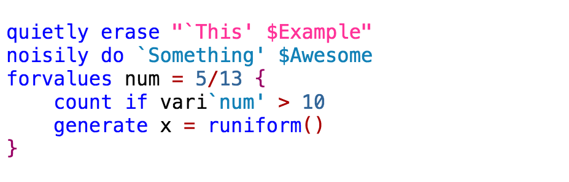

# MarkDoc : a general-purpose literate programming package for Stata

<a href="http://haghish.com/markdoc"></a>

**MarkDoc** is a general-purpose literate programming package for Stata. **MarkDoc** is very simple and intuitive to use, yet a powerful software for creating dynamic documents interactively in a variety of formats such as *sthlp*, *pdf*, *docx*, *tex*, *html*, *odt*, *epub*, and *markdown*. The software has a considerable focus on making literate programming easy-to-learn and practice for newbies. Therefore, it can be taught to undergraduate students in introductory courses to document code and practice statistical reporting. [**Continue to MarkDoc documentation**...](https://github.com/haghish/MarkDoc/wiki)

<!--
<a></a> MarkDoc receives constant updates on GitHub and users are recommended to __Watch__ the package updates from GitHub.
-->

## Resources


<a href="https://github.com/haghish/markdoc/wiki">Manual</a>

<a href="https://github.com/haghish/markdoc/raw/master/Help/Help.pdf">MarkDoc package vignette (PDF)</a>

<a href="http://www.stata-journal.com/article.html?article=pr0064">Journal Article</a>

<a href="https://github.com/haghish/MarkDoc/tree/master/Examples">Examples</a>

<a href="https://github.com/haghish/markdoc/tree/master/Torture_test">Torture tests</a>

<a href="http://www.statalist.org">Need help? Ask your questions on statalist.org</a>

<a href="http://www.haghish.com/contact.php"><b>Need more help</b>? Contact the author to plan a workshop in your department or company</a>


Installation
------------

MarkDoc requires a few other Stata packages. The [__`github package`__](https://github.com/haghish/github) can be used to install MarkDoc and all of its dependencies as shown below. Using `github` package is highly recommended.  

```js
github install haghish/markdoc
```


MarkDoc also requires 3 third-party software, which are:

- [__Pandoc__](http://pandoc.org/installing.html)
- [__wkhtmltopdf__](http://wkhtmltopdf.org/downloads.html)
- [__pdfLaTeX__](https://www.latex-project.org/get/)

The __pdfLaTeX__ is optional, but required for generating PDF slides and typesetting documents written in LaTeX. The __wkhtmltopdf__ is only required for generating PDF documents from Markdown. MarkDoc provides optional automatic installation of __pandoc__ and __wkhtmltopdf__ if the `install` argument is specified. [You can read more about the installation in the manual...](https://github.com/haghish/markdoc/wiki/Installation)


Dialog box
----------

To further facilitate using MarkDoc for beginners, a dialog box was written for Stata, which covers all features and most of the important options of MarkDoc. The dialog box supports all three engines of MarkDoc for creating 
_dynamic document_, _dynamic presentation slides_, and _package vignette (e.g. Stata help files, package manual, etc)_. 

To use the dialog box, type:

    db markdoc
    
<center>
<a href="https://github.com/haghish/MarkDoc/wiki/GUI"></a>
</center>

[The dialog box is documented in details in the manual](https://github.com/haghish/MarkDoc/wiki/GUI). Stata users that are new to MarkDoc are encouraged to have a look at the dialog box to get an idea of what they can do with MarkDoc. 

Built-in syntax highlighter
---------------------------

Wish to develop handouts or presentation slides within Stata? MarkDoc has a built-in syntax highlighter for Stata code in HTML, LaTeX, and PDF formats, including presentation slides! You can also add the syntax highlighter to your blog! [Read how...](https://github.com/haghish/statax)



Much effort was put to develop a syntax highlighter for Stata, which was not available before. This just shows how caring MarkDoc is, when it comes to teaching statistics! MarkDoc was intended to be used in daily routine, as early as introductory statistics courses to help students document their code and read it with more care. 


Author
------
  **E. F. Haghish, Ph.D.**    
  Department of Medical Psychology and Medical Sociology,     
  University of Göttingen, Germany     
  
  _http://www.haghish.com/contact.php_   
  _[@Haghish](https://twitter.com/Haghish)_   
  
  
  
 
