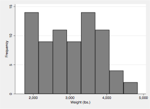

          . do test1.do

Title 1
=======

**Hello** *World*!

**hello** world! **what *the hell* is going on**! this is cool!
***we can also try a combination*** of these two! (_difficult_) **tests**. 
(*are*) also **WELCOMED**! 

And we can simple add multiple paragraphs? That is actually cool!  
In Markdown you can do a line break  
by adding 2 spaces at the end of the line  
without creating a new paragraph! 

Header 1
========

Let's Try a code
----------------

### Code chunk!

    This is a code! **DO NOT INTERPRET**
    This is another code line
    
    Yet another one

this is a paragraph again. We do not expect anything fuzzy here!

Adding a figure with caption
----------------------------

Adding a table with **tbl** command
-----------------------------------

- - -

- - -

"Column1"|"Column2"|"Column3"     
:--------|:--------:|:--------:   
4|5|6 
7|8|9 
"OKOK"|"WHAT"|"NO WAY"  
"Let's try adding a long text here"|"and a semi long text here"|"NO WAY" 

## Adding Indention

You can also indent your text as well as do nested indention. Use the ">" sign
at the beginning of the line to indent it.

> this is a Markdown indention

> > this is indention level 2

> > > this is indention level 3

Adding a list
-------------

Stata's **markdown** command supports Markdown lists and nesting lists. 
However, **putdocx** and **putpdf** do not support lists yet. There has been 
a workaround to support Markdown lists in **md2doc**. But nested lists are 
not yet implemented because they look rather ugly without a decent support 
of lists in the document... 

1. This is a list
2. This is list 2
3. This is list 3

- This is unordered list
- This is also unordered list

* These are paragraph breaks
* And so is this one

Code block
----------

~~~
This is a code block
          anything
                                 written here
             will be preserved
~~~

Limitations
-----------

Some of the Markdown syntax is **NOT** yet supported by Stata's **putdocx** or 
**putpdf** commands. These limitations are listed below:

1. horizontal line
2. Hyperlink
3. Nested lists
4. Mathematical notations

